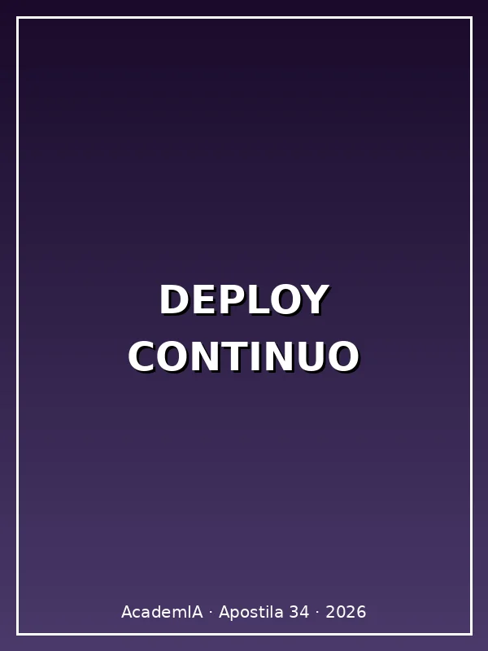

**Apostila 34 · Deploy Contínuo de Agentes IA**

*Como colocar agentes IA em produção de forma confiável, com CI/CD, testes automatizados, feature flags, observabilidade, e rollback em < 1 minuto.*

**Por MMN_IA Collective · Academ'IA**

Nexus Affil'IA'te · 2026



**Sobre esta apostila**

A maioria dos agentes morre em **staging** porque ninguém sabe **promover pra produção com segurança**. Ou pior: vai pra produção, dá bug, e fica 6h fora do ar porque não tem como voltar.

Esta apostila mostra como **matar deploy manual** e usar CI/CD + feature flags + observabilidade + rollback pra colocar agentes em produção **10x mais rápido**, com **99.9% de uptime**.

**TL;DR:** Pipeline de deploy = GitHub Actions (CI) + Docker (build) + Kubernetes (deploy) + Feature Flags (controle) + Sentry (erros) + Grafana (métricas). Rollback = 1 comando em < 60s.

---

# Sumário

**PARTE I — FUNDAMENTOS**

1. [Por que deploy de agente IA é diferente](#cap1)
2. [Os 4 estágios do deploy moderno](#cap2)
3. [CI/CD: o que é e por que importa](#cap3)

**PARTE II — PIPELINE**

4. [GitHub Actions: setup mínimo](#cap4)
5. [Testes automatizados (unit + integration + e2e)](#cap5)
6. [Build de imagem Docker multi-stage](#cap6)
7. [Deploy em Kubernetes (k8s)](#cap7)

**PARTE III — PRODUÇÃO**

8. [Feature flags para rollout gradual](#cap8)
9. [Observabilidade em produção](#cap9)
10. [Rollback automático em < 60s](#cap10)
11. [Blue-green deployment](#cap11)
12. [Canary release](#cap12)

Epílogo: [O pipeline dos sonhos em 2027](#epilogo)

Apêndice: [Templates YAML prontos](#apendice)

---

<a id="cap1"></a>
# Capítulo 1 — Por que deploy de agente IA é diferente

Deploy de agente IA tem **3 particularidades** vs deploy de app tradicional:

### 1. Não-determinismo

LLM é **probabilístico**. Mesmo input pode gerar output diferente. Você não pode testar "input X gera output Y" com 100% de certeza.

**Solução:** use **LLM-as-judge** (outro LLM avalia qualidade) ou **métricas probabilísticas** (similarity score).

### 2. Custos variáveis

Uma request pode custar R$ 0.01 ou R$ 1.00 dependendo do tamanho do contexto, modelo usado, e número de tokens.

**Solução:** implemente **circuit breaker** + **rate limit** + **alertas de custo** (avise se passar de X R$/h).

### 3. Dependências externas (LLM providers)

Se OpenAI/Claude/anthropic está fora, **seu agente também está**.

**Solução:** **multi-provider fallback** (se OpenAI cai, usa Anthropic).

---

<a id="cap2"></a>
# Capítulo 2 — Os 4 estágios do deploy moderno

```
Commit → CI (test) → Build (Docker) → Deploy (k8s) → Monitoring
              ↓                ↓                ↓
            falha          falha           falha
              ↓                ↓                ↓
           BLOCK         bloqueia         rollback
```

**Estágio 1 — Commit (dev)**
- Dev faz `git push`
- PR aberto

**Estágio 2 — CI (test)**
- Roda testes unit, integration, e2e
- Lint, type check
- Security scan (SAST)
- **Falha aqui = PR bloqueado**

**Estágio 3 — Build (Docker)**
- Build de imagem Docker
- Push pra registry (ECR, GCR, Docker Hub)
- Tag com git SHA

**Estágio 4 — Deploy (k8s)**
- Aplica Kubernetes manifests
- Rolling update (substitui pod a pod)
- Health check antes de marcar como "ready"

**Estágio 5 — Monitoring (post-deploy)**
- Métricas (latência, erro, custo)
- Logs
- Alertas

**Falha em qualquer estágio = rollback automático para versão anterior**

---

<a id="cap3"></a>
# Capítulo 3 — CI/CD: o que é e por que importa

**CI (Continuous Integration)** = cada commit é testado automaticamente.

**CD (Continuous Deployment)** = cada commit aprovado vai direto pra produção.

**Por que importa:**

| Sem CI/CD | Com CI/CD |
|-----------|-----------|
| Deploy manual = erro humano | Deploy automatizado = consistente |
| Demora 30-60 min | Demora 5-10 min |
| Difícil de reverter | Rollback = 1 comando |
| Só dev senior faz | Qualquer dev faz |

**Adoção em 2026:** 78% das empresas têm CI/CD (vs 35% em 2020). Ficar de fora = ficar pra trás.

---

<a id="cap4"></a>
# Capítulo 4 — GitHub Actions: setup mínimo

```yaml
# .github/workflows/deploy.yml
name: Deploy Agent

on:
  push:
    branches: [main]
  pull_request:
    branches: [main]

jobs:
  test:
    runs-on: ubuntu-latest
    steps:
      - uses: actions/checkout@v4
      
      - name: Setup Python
        uses: actions/setup-python@v5
        with:
          python-version: '3.12'
      
      - name: Install deps
        run: |
          pip install -r requirements.txt
          pip install pytest pytest-cov
      
      - name: Lint
        run: ruff check .
      
      - name: Type check
        run: mypy .
      
      - name: Test
        run: pytest --cov=app --cov-fail-under=80
      
      - name: Security scan
        run: bandit -r app/

  build:
    needs: test
    if: github.ref == 'refs/heads/main'
    runs-on: ubuntu-latest
    steps:
      - uses: actions/checkout@v4
      
      - name: Build Docker image
        run: |
          docker build -t agent:${{ github.sha }} .
          docker tag agent:${{ github.sha }} registry.example.com/agent:${{ github.sha }}
      
      - name: Push to registry
        run: docker push registry.example.com/agent:${{ github.sha }}
      
      - name: Deploy to staging
        run: |
          kubectl set image deployment/agent \
            agent=registry.example.com/agent:${{ github.sha }} \
            --namespace=staging
          kubectl rollout status deployment/agent -n staging

  deploy-prod:
    needs: build
    if: github.ref == 'refs/heads/main'
    runs-on: ubuntu-latest
    environment: production  # requer aprovação manual
    steps:
      - name: Deploy to production
        run: |
          kubectl set image deployment/agent \
            agent=registry.example.com/agent:${{ github.sha }} \
            --namespace=production
          kubectl rollout status deployment/agent -n production
```

**Como funciona:**

1. **PR aberto** → roda só `test` (rápido, 5min)
2. **PR mergeado em main** → roda `test` + `build` + `deploy-staging`
3. **Manual approval** → roda `deploy-prod`

---

<a id="cap5"></a>
# Capítulo 5 — Testes automatizados

### 1. Testes unit (rápido, isolado)

```python
def test_skill_consultar_produto():
    skill = ConsultarProduto()
    result = skill.execute({"produto_id": "X123"})
    assert result["preco"] > 0
    assert "desconto" in result
```

### 2. Testes de integração (médio, com DB/Redis)

```python
def test_agent_with_real_llm():
    agent = MyAgent()
    response = agent.run("Quanto custa o produto X?")
    assert "R$" in response
    assert response["latency_ms"] < 3000
```

### 3. Testes end-to-end (lento, sistema completo)

```python
def test_full_user_journey():
    # Simula usuário conversando com agente
    session = start_session(user_id="test-user")
    response = send_message(session, "Oi, quanto custa o curso X?")
    assert "R$" in response
    response = send_message(session, "Quero comprar")
    assert "link" in response or "checkout" in response
```

### 4. Testes de qualidade do LLM (avaliação)

```python
def test_llm_output_quality():
    cases = [
        ("input 1", "expected keywords"),
        ("input 2", "expected keywords"),
    ]
    for input_text, expected in cases:
        output = agent.run(input_text)
        # Use outro LLM para avaliar
        score = judge_llm.score(
            prompt=f"Output: {output}\nExpected: {expected}",
            criteria="relevance, accuracy, helpfulness"
        )
        assert score > 0.8
```

### 5. Testes de carga (performance)

```python
def test_100_concurrent_requests():
    import concurrent.futures
    with concurrent.futures.ThreadPoolExecutor(max_workers=100) as executor:
        futures = [executor.submit(agent.run, "test") for _ in range(100)]
        results = [f.result(timeout=10) for f in futures]
    assert all(r["status"] == "success" for r in results)
```

---

<a id="cap6"></a>
# Capítulo 6 — Build de imagem Docker multi-stage

```dockerfile
# Estágio 1: deps
FROM python:3.12-slim AS builder
WORKDIR /app
COPY requirements.txt .
RUN pip install --user --no-cache-dir -r requirements.txt

# Estágio 2: runtime (imagem final menor)
FROM python:3.12-slim AS runtime
WORKDIR /app

# Copia apenas deps instaladas (não código fonte)
COPY --from=builder /root/.local /root/.local
ENV PATH=/root/.local/bin:$PATH

# Copia código
COPY . .

# Usuário não-root (segurança)
RUN useradd -m appuser
USER appuser

# Health check
HEALTHCHECK --interval=30s --timeout=5s --retries=3 \
  CMD curl -f http://localhost:8000/health || exit 1

EXPOSE 8000
CMD ["uvicorn", "app.main:app", "--host", "0.0.0.0", "--port", "8000"]
```

**Tamanhos típicos:**

| Tipo | Tamanho |
|------|---------|
| Sem multi-stage | 1.2GB |
| Com multi-stage | 280MB |
| Com distroless | 80MB |

---

<a id="cap7"></a>
# Capítulo 7 — Deploy em Kubernetes (k8s)

```yaml
# k8s/deployment.yml
apiVersion: apps/v1
kind: Deployment
metadata:
  name: agent
  namespace: production
spec:
  replicas: 3
  strategy:
    type: RollingUpdate
    rollingUpdate:
      maxSurge: 1        # até 1 pod extra durante update
      maxUnavailable: 0  # zero downtime
  selector:
    matchLabels:
      app: agent
  template:
    metadata:
      labels:
        app: agent
    spec:
      containers:
      - name: agent
        image: registry.example.com/agent:latest
        ports:
        - containerPort: 8000
        env:
        - name: OPENAI_API_KEY
          valueFrom:
            secretKeyRef:
              name: agent-secrets
              key: openai-key
        - name: REDIS_URL
          valueFrom:
            secretKeyRef:
              name: agent-secrets
              key: redis-url
        resources:
          requests:
            cpu: 200m
            memory: 512Mi
          limits:
            cpu: 1000m
            memory: 2Gi
        livenessProbe:
          httpGet:
            path: /health
            port: 8000
          initialDelaySeconds: 30
          periodSeconds: 10
        readinessProbe:
          httpGet:
            path: /ready
            port: 8000
          initialDelaySeconds: 5
          periodSeconds: 5
---
apiVersion: v1
kind: Service
metadata:
  name: agent
  namespace: production
spec:
  selector:
    app: agent
  ports:
  - port: 80
    targetPort: 8000
  type: LoadBalancer
```

**Comandos úteis:**

```bash
# Ver status
kubectl get pods -n production

# Logs
kubectl logs -f deployment/agent -n production

# Rollback
kubectl rollout undo deployment/agent -n production

# Escalar
kubectl scale deployment/agent --replicas=5 -n production
```

---

<a id="cap8"></a>
# Capítulo 8 — Feature flags para rollout gradual

**Feature flag** = toggle em runtime que ativa/desativa funcionalidade.

```python
from flagsmith import Flagsmith

flagsmith = Flagsmith(environment_key="...")

def new_skill_consultar_produto_v2(user_id: str):
    if flagsmith.is_feature_enabled("skill_v2", user_id):
        return skill_v2.execute(...)
    else:
        return skill_v1.execute(...)
```

**Tipos de rollout:**

| Estratégia | % de usuários | Quando usar |
|------------|---------------|-------------|
| Internal | Só time | Teste inicial |
| Canary | 1-5% | Detectar bugs latentes |
| Beta | 10-25% | Feedback de early adopters |
| Gradual | 50% → 100% | Rollout amplo |

**Vantagem:** se der bug, **muda a flag = 0 impacto**.

**Ferramentas:** Flagsmith, LaunchDarkly, Unleash, ou **custom (Postgres + Redis)**.

---

<a id="cap9"></a>
# Capítulo 9 — Observabilidade em produção

### 3 pilares (já vimos na apostila 33):

**1. Logs (Pino, structlog)**
```python
logger.info({
    "event": "agent.execute",
    "trace_id": trace_id,
    "user_id": user_id,
    "duration_ms": 245,
    "cost_cents": 12,
    "status": "success"
})
```

**2. Métricas (Prometheus + Grafana)**
- Latência p95/p99
- Taxa de erro
- Custo por hora
- Volume de requests

**3. Traces (OpenTelemetry + Jaeger)**
- Span: "LLM call"
- Span: "DB query"
- Span: "API call"
- **Trace:** jornada completa

**Alertas críticos:**

```yaml
# alertmanager.yml
- alert: HighErrorRate
  expr: rate(http_requests_total{status=~"5.."}[5m]) > 0.05
  for: 5m
  labels:
    severity: critical
  annotations:
    summary: "Error rate > 5%"

- alert: HighCost
  expr: increase(agent_cost_cents_total[1h]) > 10000
  for: 5m
  labels:
    severity: warning
  annotations:
    summary: "Cost spike: > R$ 100/h"
```

---

<a id="cap10"></a>
# Capítulo 10 — Rollback automático em < 60s

**Estratégia 1: Rollback por health check**

```yaml
# k8s/deployment.yml
spec:
  strategy:
    type: RollingUpdate
    rollingUpdate:
      maxSurge: 1
      maxUnavailable: 0
  template:
    spec:
      containers:
      - name: agent
        livenessProbe:
          httpGet:
            path: /health
            port: 8000
          failureThreshold: 3
```

Se o pod não responde 3x em health check, k8s mata e substitui. Se persistir, **rollback automático**.

**Estratégia 2: Rollback por métrica**

```python
# Auto-rollback script (roda a cada 1min via CronJob)
def check_and_rollback():
    error_rate = get_metric("error_rate_5m")
    p95_latency = get_metric("latency_p95_5m")
    cost_per_hour = get_metric("cost_per_hour")
    
    if error_rate > 0.10 or p95_latency > 10_000 or cost_per_hour > 1000:
        logger.critical("Auto-rollback triggered")
        run_kubectl("rollout undo deployment/agent -n production")
        send_alert_to_oncall("Auto-rollback executed")
```

**Estratégia 3: Rollback por feature flag**

Se a nova feature causa problema, **desliga a flag** (não precisa redeploy).

---

<a id="cap11"></a>
# Capítulo 11 — Blue-green deployment

```
Production:
  Blue (versão atual)   →  recebe 100% do tráfego
  Green (nova versão)   →  recebe 0% do tráfego
```

**Workflow:**

1. Deploy nova versão como "green"
2. Smoke test no green
3. Switch do load balancer: blue → green
4. Se der problema, switch de volta: green → blue
5. Blue vira a "nova atual" (ou é deletado)

**Vantagem:** rollback = 1 segundo (só switchar LB).

**Desvantagem:** precisa de **2x recursos** durante deploy.

---

<a id="cap12"></a>
# Capítulo 12 — Canary release

```
Production:
  Versão atual (95%)  →  recebe 95% do tráfego
  Nova versão (5%)    →  recebe 5% do tráfego
```

**Workflow:**

1. Deploy nova versão com 5% do tráfego (5 réplicas)
2. Monitora métricas por 30min
3. Se OK: aumenta para 25%, 50%, 100%
4. Se ruim: rollback (deleta os 5% canary)

**Vantagem:** detecta bug com impacto limitado (5% dos usuários).

**Desvantagem:** mais complexo (precisa de LB que faz traffic split).

**Ferramenta:** Istio, Linkerd, ou AWS ALB com weighted target groups.

---

<a id="epilogo"></a>
# Epílogo — O pipeline dos sonhos em 2027

**Stack final recomendado:**

| Camada | Ferramenta |
|--------|-----------|
| Code | Python 3.12 + FastAPI |
| Testes | pytest + coverage + LLM-as-judge |
| CI | GitHub Actions |
| Build | Docker multi-stage |
| Registry | AWS ECR / GCP Artifact Registry |
| Deploy | Kubernetes (EKS/GKE) |
| Service mesh | Istio |
| Observability | Grafana + Loki + Tempo + Sentry |
| Feature flags | Flagsmith |
| Custo monitoring | CloudZero / Vantage |
| Security | Snyk + Trivy |

**Resultado:**

- **Deploy time:** 5 minutos (vs 1h manual)
- **Lead time for changes:** < 1h (commit → prod)
- **MTTR (mean time to recovery):** < 5min (rollback automático)
- **Deploy frequency:** 10-50/dia (vs 1/semana)
- **Change failure rate:** < 5% (vs 20%)

**Isso é o estado da arte em 2027. Mas começa simples:**

1. **Hoje:** GitHub Actions + Docker
2. **Em 1 mês:** k8s básico
3. **Em 3 meses:** feature flags
4. **Em 6 meses:** observability completa
5. **Em 12 meses:** pipeline dos sonhos

**Não tente tudo de uma vez.**

---

<a id="apendice"></a>
# Apêndice — Templates YAML prontos

### Template: GitHub Actions com múltiplos estágios

```yaml
name: Deploy Agent (Production)

on:
  push:
    branches: [main]
    paths:
      - 'app/**'
      - 'tests/**'

env:
  REGISTRY: registry.example.com
  IMAGE_NAME: agent

jobs:
  lint:
    runs-on: ubuntu-latest
    steps:
      - uses: actions/checkout@v4
      - uses: actions/setup-python@v5
        with: { python-version: '3.12' }
      - run: pip install ruff mypy bandit
      - run: ruff check app/
      - run: mypy app/
      - run: bandit -r app/

  test:
    runs-on: ubuntu-latest
    needs: lint
    steps:
      - uses: actions/checkout@v4
      - uses: actions/setup-python@v5
        with: { python-version: '3.12' }
      - run: pip install -r requirements.txt -r requirements-dev.txt
      - run: pytest --cov=app --cov-fail-under=80 -v
      - run: pytest tests/e2e/ -v --maxfail=3

  build:
    runs-on: ubuntu-latest
    needs: test
    if: github.ref == 'refs/heads/main'
    steps:
      - uses: actions/checkout@v4
      - name: Set up Docker Buildx
        uses: docker/setup-buildx-action@v3
      - name: Login to registry
        uses: docker/login-action@v3
        with:
          registry: ${{ env.REGISTRY }}
          username: ${{ secrets.REGISTRY_USER }}
          password: ${{ secrets.REGISTRY_PASS }}
      - name: Build and push
        uses: docker/build-push-action@v5
        with:
          context: .
          push: true
          tags: |
            ${{ env.REGISTRY }}/${{ env.IMAGE_NAME }}:${{ github.sha }}
            ${{ env.REGISTRY }}/${{ env.IMAGE_NAME }}:latest
          cache-from: type=gha
          cache-to: type=gha,mode=max

  deploy-staging:
    runs-on: ubuntu-latest
    needs: build
    steps:
      - uses: actions/checkout@v4
      - name: Deploy to staging
        run: |
          echo "${{ secrets.KUBECONFIG_STAGING }}" | base64 -d > /tmp/kubeconfig
          KUBECONFIG=/tmp/kubeconfig kubectl set image deployment/agent agent=${{ env.REGISTRY }}/${{ env.IMAGE_NAME }}:${{ github.sha }} -n staging
          KUBECONFIG=/tmp/kubeconfig kubectl rollout status deployment/agent -n staging --timeout=5m
      - name: Smoke test
        run: |
          sleep 30
          curl -f https://agent.staging.example.com/health || exit 1

  deploy-prod:
    runs-on: ubuntu-latest
    needs: deploy-staging
    environment:
      name: production
      url: https://agent.example.com
    steps:
      - name: Deploy to production
        run: |
          echo "${{ secrets.KUBECONFIG_PROD }}" | base64 -d > /tmp/kubeconfig
          KUBECONFIG=/tmp/kubeconfig kubectl set image deployment/agent agent=${{ env.REGISTRY }}/${{ env.IMAGE_NAME }}:${{ github.sha }} -n production
          KUBECONFIG=/tmp/kubeconfig kubectl rollout status deployment/agent -n production --timeout=10m
      - name: Notify
        uses: slackapi/slack-github-action@v1
        with:
          payload: |
            {
              "text": "✅ Agent deployed to production: ${{ github.sha }}"
            }
        env:
          SLACK_WEBHOOK_URL: ${{ secrets.SLACK_WEBHOOK }}
```

### Template: Kubernetes deployment com health check

```yaml
apiVersion: apps/v1
kind: Deployment
metadata:
  name: agent
  namespace: production
  labels:
    app: agent
    version: v1
spec:
  replicas: 3
  strategy:
    type: RollingUpdate
    rollingUpdate:
      maxSurge: 1
      maxUnavailable: 0
  selector:
    matchLabels:
      app: agent
  template:
    metadata:
      labels:
        app: agent
        version: v1
    spec:
      containers:
      - name: agent
        image: registry.example.com/agent:latest
        ports:
        - containerPort: 8000
        env:
        - name: ENV
          value: production
        - name: LOG_LEVEL
          value: info
        envFrom:
        - secretRef:
            name: agent-secrets
        resources:
          requests:
            cpu: 200m
            memory: 512Mi
          limits:
            cpu: 1000m
            memory: 2Gi
        livenessProbe:
          httpGet:
            path: /health
            port: 8000
          initialDelaySeconds: 30
          periodSeconds: 10
          timeoutSeconds: 5
          failureThreshold: 3
        readinessProbe:
          httpGet:
            path: /ready
            port: 8000
          initialDelaySeconds: 5
          periodSeconds: 5
          timeoutSeconds: 3
          failureThreshold: 2
        lifecycle:
          preStop:
            exec:
              command: ["sh", "-c", "sleep 15"]
```

### Template: Auto-rollback CronJob

```yaml
apiVersion: batch/v1
kind: CronJob
metadata:
  name: agent-auto-rollback
  namespace: production
spec:
  schedule: "*/1 * * * *"  # a cada 1min
  jobTemplate:
    spec:
      template:
        spec:
          serviceAccountName: agent-admin
          containers:
          - name: check
            image: registry.example.com/agent-admin:latest
            command:
            - python
            - -c
            - |
              import os, requests
              from prometheus_api_client import PrometheusConnect
              
              prom = PrometheusConnect(url="http://prometheus.monitoring.svc.cluster.local")
              
              error_rate = float(prom.get_current_metric_value("rate(http_requests_total{status=~'5..'}[5m])")[0]['value'][1])
              p95_latency = float(prom.get_current_metric_value("histogram_quantile(0.95, rate(http_request_duration_seconds_bucket[5m]))")[0]['value'][1])
              cost_per_hour = float(prom.get_current_metric_value("increase(agent_cost_cents_total[1h])")[0]['value'][1])
              
              if error_rate > 0.10 or p95_latency > 10 or cost_per_hour > 1000_00:
                  print(f"ALERT: error={error_rate} p95={p95_latency} cost={cost_per_hour}")
                  os.system("kubectl rollout undo deployment/agent -n production")
                  requests.post(os.environ["SLACK_WEBHOOK"], json={"text": f"🚨 Auto-rollback: error={error_rate:.2%} p95={p95_latency:.0f}s cost=R${cost_per_hour/100:.0f}"})
          restartPolicy: Never
```

---

*Fim da Apostila 34 · Deploy Contínuo de Agentes IA*

*MMN_IA Collective · 2026 · Licença: CC BY-SA 4.0*

*"Deploy manual é o anti-padrão número 1. Se você ainda faz deploy manual, pare. Crie um pipeline CI/CD em 1 semana e nunca mais volte atrás."*